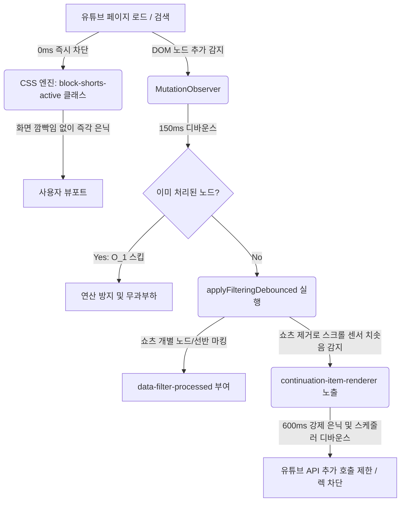

# YouTube Shorts Filtering Architecture

유튜브 검색 결과 및 메인 피드에서 쇼츠(Shorts) 요소를 제거하고 무한 스크롤 성능 저하(렉)를 방지하기 위해 설계된 Botox 확장 프로그램의 필터링 코어 아키텍처 사양서입니다.

---

## 1. 아키텍처 개요 (Overview)

유튜브의 동적 렌더링 환경에서 쇼츠를 필터링할 때 발생하는 **"1) 초기 깜빡임(Layout Shift)"**과 **"2) 무한 추가 로딩 루프에 의한 렌더링 렉"**을 극복하기 위해 **"CSS 선제 차단 + JS 동적 제어 + Continuation 센서 지연"**이 결합된 하이브리드 아키텍처를 채택했습니다.



---

## 2. 핵심 구현 구성 요소 (Core Components)

### 2.1. CSS 선제 은닉 레이어 (Zero-Delay Hide)
*   **파일 위치**: `content.css`
*   **원리**: JavaScript가 초기 구동되고 DOM 탐색 엔진이 돌기 전에 브라우저가 HTML을 파싱하는 즉시 렌더링 트리에서 쇼츠 요소를 배제합니다.
*   **세부 규칙**:
    ```css
    body.botox-shorts-active ytd-reel-shelf-renderer,
    body.botox-shorts-active ytd-reel-item-renderer,
    body.botox-shorts-active grid-shelf-view-model,
    body.botox-shorts-active ytd-video-renderer:has(a[href*="/shorts/"]),
    body.botox-shorts-active ytd-video-renderer:has(a[href*="/shorts?"]),
    body.botox-shorts-active ytd-video-renderer:has(a[href$="/shorts"]),
    body.botox-shorts-active ytd-rich-item-renderer:has(a[href*="/shorts/"]),
    body.botox-shorts-active ytd-rich-item-renderer:has(a[href*="/shorts?"]),
    body.botox-shorts-active ytd-rich-item-renderer:has(a[href$="/shorts"]),
    body.botox-shorts-active ytd-compact-video-renderer:has(a[href*="/shorts/"]),
    body.botox-shorts-active ytd-compact-video-renderer:has(a[href*="/shorts?"]),
    body.botox-shorts-active ytd-compact-video-renderer:has(a[href$="/shorts"]) {
      display: none !important;
    }
    ```
*   **동작 제어**: `content.js` 초기화 시 및 옵션 변경 시 `document.body`에 `botox-shorts-active` 클래스를 추가/제거하여 0ms 반응 속도로 토글을 제어합니다.

### 2.2. 무한 스크롤 폭주 억제기 (Continuation Throttle)
*   **대상 엘리먼트**: `ytd-continuation-item-renderer` (유튜브의 다음 페이지 로딩 센서 비디오 카드)
*   **원리**: 쇼츠 비디오 카드가 필터링에 의해 대거 제거(`display: none`)되면, 화면 세로 길이가 급격히 수축하여 하단에 위치해야 할 로딩 센서가 화면 뷰포트 내에 강제로 들어오게 됩니다. 이로 인해 유튜브 엔진이 자동으로 다음 페이지 API 요청을 연사 호출하는 무한 페치 루프가 발생합니다.
*   **해결책**:
    *   `MutationObserver` 콜백 내에서 `ytd-continuation-item-renderer`를 감지하면 즉시 해당 센서 요소를 강제 은닉(`display: none !important`)합니다.
    *   동시에 `600ms` 스케줄러 디바운스를 걸어두고, 600ms가 지난 뒤에 센서를 다시 노출시킵니다. 이 조치로 인해 브라우저가 추가 영상 목록을 초당 수십 회씩 페치하는 현상을 방지하고 스크롤 렉을 해결합니다.

### 2.3. O(1) 필터 스킵 캐싱 레이어 (State Marking)
*   **원리**: 스크롤이 내려갈 때마다 화면에 이미 표시되어 필터링 검증이 완료된 수백 개의 일반 비디오 노드를 매번 MutationObserver가 재스캔하여 `innerHTML` 검색이나 `querySelector` 오버헤드를 일으키는 현상을 방지합니다.
*   **해결책**:
    *   필터 처리가 끝난 비디오 노드에는 `WeakSet` 메모리 주소 매핑을 활용해 중복 검사를 방지합니다.
    *   다음 스캔 시 캐시에 존재하는 노드는 연산 없이 즉시 `return` 처리하여 DOM 전체 탐색 비용을 최소화합니다.

### 2.4. 비동기 디바운스 렌더링 (Debounced Filtering)
*   **원리**: 브라우저의 레이아웃 스레드와 스크립트 실행 스레드의 충돌을 완화하기 위해 `150ms` 디바운싱 타이머를 통해 연속적인 Mutation 이벤트를 하나의 프레임 버퍼로 모아 일괄 처리합니다.
